## Quick Start


#### Install SART
```bash
git clone https://github.com/dstanesc/sart-framework.git
```

#### Start Zookeeper
```bash
bin/zookeeper-server-start.sh config/zookeeper.properties
```

#### Start Kafka
```bash
bin/kafka-server-start.sh config/server.properties
```

#### Start Demo

Terminal 1

```bash
./gradlew :sart-cae-transaction:bootRun

```

Terminal 2

```bash
./gradlew :sart-cae-proj:bootRun

```
Terminal 3

```bash
./gradlew :sart-cae-conflict:bootRun
```

##### Open Monitoring Dashboard

```bash
http://localhost:8080/sart.html
```

##### Execute Tests
```bash
./gradlew :sart-cae-transaction:test --tests org.sartframework.demo.cae.ValidationSuite  
```


# Simple API for Reified Transactions (SART)


## Introduction

There is an substantial body of evidence collected in the Simulation Data Management field proving the inefficiency (sometimes lack of robustness or predictable behavior) of lock based concurrency safeguards for parallel business transactions. In this context we refer as _Business Transaction_ the long running batch operation producing or modifying large amounts of data.

Consequently current paper started as a design exercise to formalize non-blocking conflict resolution patterns for long running parallel data processing activities. However very soon becomes evident that a larger context of investigation is required to design scalable and resilient data management and processing applications.

The ultimate goal for non-blocking parallel execution is application performance and throughput but the full potential of such architectural building blocks is only harvested in case non-blocking strategies and scalability concerns are consistently recognized and  addressed across all architectural elements including a fresh perspective on APIs and use-cases themselves. As result an ubiquitous pattern for application design emerges. This represents a fundamental shift to the existing Simulation Data Management architecture.


## Fundamentals


The central concern of any data management system is maintaining data integrity which in essence represents the absence of corruption or data loss. Such safety guarantees are traditionally provided by _database transactions_ as described by the well known acronym ACID (Atomicity, Consistency, Isolation, Durability). 

> A transaction is  a way for an application to group several reads and writes together into a logical unit. Conceptually, all their reads and writes in a transaction are executed as one operation: either the entire transaction succeeds (commit) or it fails (abort, rollback) ... With transactions, error handling becomes much simpler for the application, because it doesn't need to worry about partial failure.

> .. they [Transactions] were created with a purpose, namely to _simplify the programming model_ for applications accessing the database. 

> _Martin Kleppmann, Design Data-Intensive Applications_ 
 
Independent of the traditional _database transaction_ characteristics, they prove to represent a powerful concept to describe data integrity and to facilitate a simplified programming model for similar abstractions such the _Business Transaction_.

_Business Transactions_ embody similar principles for application level workflows, fundamental distinctions being that they are typically much __longer lived__ (_database transactions_ are notorious for the need to remain short lived because of the side-effects locking has on parallel processing) and span usually over __heterogeneous persistence technologies__ (traditional 2PC/XA also notorious for the performance penalties). 

Although not always mandatory (for instance in Simulation Data Management, isolation concerns are addressed with optional query criteria, eg. filter objects on completed processes, _business transactions_ benefit from controlled Isolation configuration. Examples are reads showing only committed data (_read committed_) or stricter, the transaction sees the data as committed in the database before it started (_snapshot isolation_ or _repeatable read_). _Snapshot isolation_ avoids that a given _business transaction_ reads different values depending on parallel transactions committed during its lifetime in the database. The _serializable_ isolation level guarantees that even when 2 or more transactions are executed in parallel the final result is the same as when both are executed sequentially (aka. serially). 

With the general considerations in mind we circle back to the fundamental aspects we want to start our journey on, namely the way _business transactions_ can operate in parallel with reduced contention and the modeling simplifications required to bring our goal closer. If we conceptualize the _Business Transaction_ as a pipeline (i.e. chain) of operations to be processed in sequential order

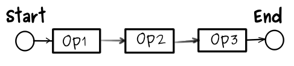

and recognize few important instruments: 

A. __Mutual Exclusion__ Transactions operating on disjunct resources are basically conflict free and fully parallelizable. 

B. __Single Writer__ When resource contention happens, to avoid locking, we could manage it by completely eliminating the parallel writes and mutate the resource using a single thread. For instance queuing all operations produced by multiple transactions, associated with a single resource represents a very simple instantiation of the Single Writer principle. 

C. __Controlled Semantics__ By providing more precise semantics for the atomic operations chained in the transaction _(deserves mentioned that although CRUD represents also a relevant set of data operations remains insufficiently descriptive for our purpose)_ the software can employ predefined conflict resolution algorithms. Even more, we find out that _a subset of atomic operations are basically conflict-free_. __Conflict-free replicated data types (CRDT)__ are a family of data structures proposed in 2011 by Marc Shapiro et al.:

> We propose the concept of a convergent or commutative replicated data type (CRDT), for which some simple mathematical properties ensure eventual consistency. A trivial example of a CRDT is a replicated counter, which converges because the increment and decrement operations commute (assuming no overflow).

> _Marc Shapiro et al, A comprehensive study of Convergent and Commutative Replicated Data Types_

supporting the idea that parallel transactions consisting of disjunct or conflict-free atomic operations __require no conflict resolution__.

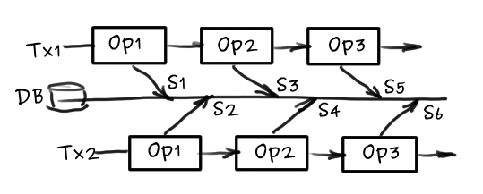


## CRDTs 

__A short reference of conflict free CRTDs__ relevant to our goal (extracted from the original study<sup>[3](#r3)</sup>) including simplified visualization of the behavior when projected to _business transaction_ operations:

> ##### 1. Operation based counter
> _"Addition and subtraction commute, assuming no overflow."_ 

Consequently 2 or more transactions incrementing / decrementing same counter are conflict-free

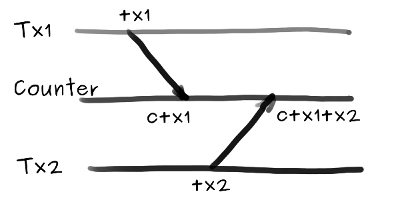

> ##### 2. Grow-Only Set (G-Set)
> _"Sets constitute one of the most basic data structures. Containers, Maps, and Graphs are all based on Sets. We consider mutating operations add (takes its union with one or more elements) and remove (performs a set-minus). Unfortunately, these operations do not commute. Therefore, a Set cannot both be a CRDT and conform to the sequential specification of a set. The simplest solution is to avoid remove altogether. A Grow-Only Set (G-Set) supports add() and lookup() operations only."_ 

Therefore 2 or more transactions only appending elements to a given Set (for example a Set representing a MANY_REF relationship) are never conflicting. 

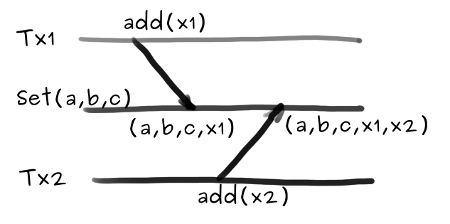

> ##### 3. Add-only monotonic DAG
> _"In general, maintaining a particular shape, such as a tree or a DAG (directed acyclic graph), cannot be done by a CRDT. However, some stronger forms of acyclicity are implied by local properties, for instance a monotonic DAG, in which an edge may be added only if it oriented in the same direction as an existing path. That is, the new edge can only strengthen the partial order defined by the DAG; it follows that the graph remains acyclic."_ 

Consequently parallel transactions can modify conflict free more complex data structures such nested tree structures using operations which maintain its monotonicity and boundaries.

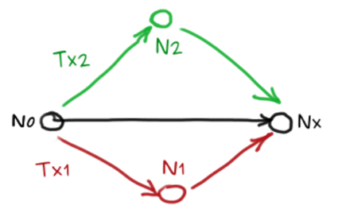

> ##### 4. Last-Writer-Wins Register (LWW-Register)
> _"A Last-Writer-Wins Register (LWW-Register) creates a total order of assignments by associating a timestamp with each update. Timestamps are assumed unique, totally ordered, and consistent with causal order; i.e., if assignment 1 happened-before assignment 2, the former’s timestamp is less than the latter’s."_ 

Last-Writer-Wins Register is a generic pattern to provide lock-less conflict resolution for otherwise conflicting operations (such modifying in parallel an arbitrary field on a contended resource). In our particular case, to achieve deterministic order the timestamps can be acquired from the timeline of the coordinating _business transaction_, such as the transaction start time.  

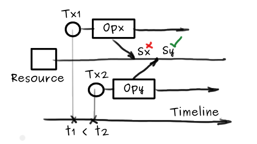

> ##### 5. Multi-Value Register (MV-Register)
> _"An alternative semantics is to define a LUB (least upper bound) operation that merges concurrent assignments, for instance taking their union."_ 
>> [Wikipedia:Supremum The supremum of a subset S of a partially ordered set T is the least element in T that is greater than or equal to all elements of S, if such an element exists. Consequently, the supremum is also referred to as the least upper bound (or LUB)]

Multi-Value Register is the other generic pattern to provide lock-less conflict resolution for actual conflicting operations (next to LWW-Register). For _business transactions_ this could mean for instance preserving all conflicting values and defer final resolution to manual merge operations. Next possibility is combining MV-Register with predefined and deterministic merge algorithms.
 


## Operation Categories

The paper uses the term _Operation_ to describe _messages_ employed by the framework to achieve a certain computation goal. Like any other exchanged _Message_, _Operations_ are immutable data structures employed for communication. Once emitted they cannot be cancelled or modified. SART Framework uses following categories of _Messages_: 

__A. Commands__ are messages reflecting operation __requests__. Commands will be accepted by the system once they are validated, otherwise rejected. For instance an invalid command should lead to the complete rollback of the _business transaction_ containing respective _Command_. Commands have typically only one receiver, eg. in SART architecture only a single _Domain Aggregate_ will process each individual _Domain Command_.

__B. Events__ are operations reflecting __state transition__. Events are generated by the system when accepting and processing valid _Commands_. An event is a fact which happened in the past and cannot be rejected, only acknowledged. Events are typically broadcasted to multiple subscribers, eg. in SART architecture the events generated by a given _Domain Aggregate_ will be consumed subsequently by the _Domain Aggregate_ itself and also any existing projection (materialized views) of the respective _Domain Aggregate_.

__C. Queries__ reflect __query operations__. Queries are equally employed synchronously, for instance interactive queries (eg. request / response) or asynchronously, such subscribing to data set changes. SART queries are typically served by a single provider, eg. a materialized view. It is also possible however that multiple providers collaborate to resolve queries federated over multiple views (or view partitions)

__D. Results__ are __response messages__ to the query operations. They typically share the structure with the entities being queried, but can carry additional metadata. SART results are typically communicated to the component issuing the query but can be easily tracked by other SART components, for instance a performance monitoring module, a traffic and error supervising module, etc.


Important to note that all SART operations:

* Are __fully instantiated artifacts__. 

* Are __stored out-of-process__, hence providing enhanced robustness and traceability guarantees. 

* Can be employed equally for __intra and inter-process communication__.   

* Carry __strong domain specificity__, such as the intent to create an input deck entity will be likely modeled using a `CreateInputDeckCommand` and issue an `InputDeckCreatedEvent` in case of success, queried by name using an `InputDeckByNameQuery` and returning an `InputDeckQueryResult`. __Use of generic constructs is vigorously discouraged__.


## The Log Structure

The model of choice for our _business transaction_, that is an operation-chain (see # 2 Fundamentals) suggests already that the closest natural representation for the set of _business transactions_ progressing in the system at any time is a superset of the individual operation-chains. 

The construct has actually a lot in common with the known _transaction log_ from traditional databases (employed to guarantee the ACID properties in case of failures) and contains the complete and ordered sequence of the incoming operations (update, compensation, commit, abort, checkpoint records) at any given time. 

For the SART transaction management system each operation, independent of its nature (ie. command, event, query), need to carry as metadata: 
* Enclosing transaction information (e.g. transaction identifier) 
* Chaining information (e.g. previous operation identifier or sequence reflecting position). 

Operations are appended sequentially to the log based on their incoming order.

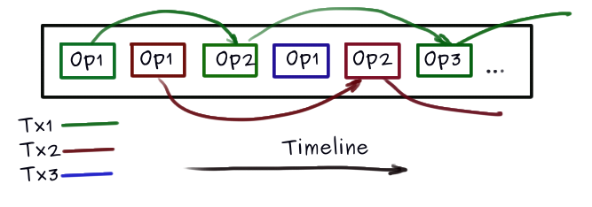

Furthermore, constraining the log to satisfy the theoretical requirements of a G-Set CRDT (see # 3.2 Grow-Only Set) __few powerful implications are emerging__:

#### A. Horizontal Scalability 

The log operations become naturally parallelizable, append operations are conflict-free, hence no overhead to obtain consensus across independent partitions. That guarantees that a _business transaction_ can reliably __write with increased throughput to multiple partitions__ of the same logical log in parallel.  

#### B. Structural Completeness 

An immutable (append only) _transaction log_ holds at any given time the complete state of the application. This fact alone is extremely powerful as the log can be used as __the actual source of truth__ for any given system. Distributed systems are particularly benefiting from that. Event Sourcing, CQRS, Kappa, Commander are examples of modern __log centric application architectural styles__. 

#### C. Explicit Timeline 

Given a __log centric__ application style, software modules and services not only can reconstruct their current state from the _log_, but __can reconstruct their historical state at any moment in the past__. State recovery at a point-in-time can be technically achieved from both ends of the log, i.e. replaying all operations from the initial state on or rewinding all operations from current state back to the desired point-in-time by applying compensating operations. The second alternative has a certain efficiency appealing and aligns with other similar technologies, like flashback database. If log operations happen in a larger context of logical transactions the point-in-time semantics can be easily interchanged with point-of-logical-consistency.

#### D. System Evolution 

A __log centric__ application style allows functional extension / upgrade / downgrade with __no downtime__ or complex ceremony, __continuous system evolution becomes a viable and more appealing option compared with traditional scheduled software maintenance__. For instance new modules or module versions can dynamically join the application ecosystem, build its own internal state from the central _immutable log_, perform self validation routines and announce availability when ready. Traffic can be routed to the new services and older versions can be retired on policy bases.

#### E. Data Replication 

Similar to traditional databases, the _log_ is probably the most suitable technology for data replication:

* Sharing state internally across application services. This is at the heart of log-centric application design. 

* Sharing data externally across sites or functional deployments (i.e from productive to test environments). The operations stored in given _operation log_ can be propagated (either in real time or scheduled) to equivalent _logs_ or _materialized views_. Even more, partial data replications (such propagating only _operations_ matching specific criteria, eg. origin or category) become a straightforward possibility.

#### F. Mechanical Sympathy

The experience so far in Simulation Data Management indicates a strong correlation between overall system performance and the I/O activities, hence the goal of any improved design will have to consider I/O cost minimization. Whether network or disk the pattern remains the same, fine granular, repetitive access tends to be expensive. For disks contiguous multi-block operations will perform much better compared to combinations of seek and read/write multiple times (SQL execution plan tuning for instance is often about optimizing the single-block to multi-block reads, but the idiom applies equally to application level data access over the network). This concept is intuitive enough when looking at mechanical drives where the disk head will need no seek time (or latency) in case next block will be located directly after previous one. However the pattern is ubiquitous and applies to any persistence media.

An interesting benchmark was published by Adam Jacobs, The Pathologies of Big Data in ACM Newsletter:


> _"On typical server hardware today, completely random memory access on a range much larger than cache size can be an order of magnitude or more slower than purely sequential access, but completely random disk access can be five orders of magnitude slower than sequential access (figure 3). Even state-of-the-art solid-state (flash) disks, although they have much lower seek latency than magnetic disks, can differ in speed by roughly four orders of magnitude between random and sequential access patterns. The results for the test shown in figure 3 are the number of four-byte integer values read per second from a 1-billion-long (4 GB) array on disk or in memory; random disk reads are for 10,000 indices chosen at random between one and 1 billion."_ 

> _Adam Jacobs, The Pathologies of Big Data_  

It is important to note that the I/O interface of the _append only log_ structure is essentially sequential.

## Transaction Log

Transaction management represents a central application of the logical _Log Structure_ in the SART Framework. As explained previously there are 2 categories of operations relevant for transaction management, the _Transaction Commands_ which are basically requests for lifecycle operations and the _Transaction Events_ which are records of successfully completed transaction lifecycle events.


The general architecture of the _Transaction Manager_ follows the teachings of _Domain Driven Design_ in that _Business Transactions_ are reified as specialized _Transaction Aggregates_ <sup>[9](#t9)</sup> which will validate incoming _Transaction Commands_ <sup>[7](#t7)</sup> and emit corresponding state changes as _Transaction Events_ <sup>[8](#t8)</sup>. 


### Transaction Commands

Supported _Transaction Commands_ are following:


| Command name | Description  |
|--------------|--------------|
|Create Transaction|Requests instantiation of a new transaction|
|Start Transaction|Starts the newly created transaction|
|Log Progress|Request to record the progress of the transaction. The incremental progress record  is essentially a transaction command wrapper on a given __Domain Event__ accepted by the system|
|Commit Transaction|Requests transaction commit|
|Abort Transaction|Requests transaction abort|
|Compensate Domain Event|Requests a compensation operation for a given __Domain Event__. Compensation operations are the means to rollback a failed transaction by applying compensation logic for each __Domain Event__ accepted so far by the system|

### Transaction Aggregate Logical Structure

The structure of the _Transaction Aggregate_ is holding basic information: transaction identifier - `xid`, transaction status - `status` and internal state to track progress, successful commit or abort : `xct` - total number of domain commands processed by current transaction, `progressCounter` - latest sequence number associated with transaction normal progress, `compensationCounter` - latest sequence number associated with transaction compensation progress (i.e. when aborting)

```javascript
{
    Long xid

    Long xct

    Integer status

    Long progressCounter

    Long compensationCounter
}
```
The simplified sequence diagram for transaction command handling is shown below, where `x` can be any of above listed, _Start Transaction_, _Log Progress_, _Commit Transaction_, _Abort Transaction_ or _Compensate DomainEvent_ command.

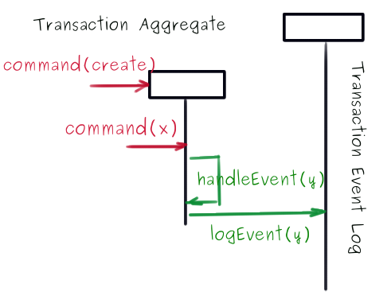

### Transaction Events

If we consider the _Transaction Aggregate_ an event driven finite state machine, _Transaction Events_ listed below are employed for the needed state transitions: 


| Event name | Description  |
|--------------|--------------|
|Transaction Created|The new transaction is valid and created|
|Transaction Started|The transaction is started|
|Transaction Commit Requested|A transaction commit is requested, this is more or less the direct translation of the __CommitTransactionCommand__ in the __Event Log__ and records the intention for the successful logical completion of the transaction. However the __Transaction Manager__ will have to assess based on progress events whether a successful commit is possible. When progress completed, i.e. expected progress events are emitted, a __TransactionCommittedEvent__ will be dispatched. It can be also the case that due to validation or systemic failures the transaction will be aborted|
|Transaction Committed|Confirms irrevocably that a given transaction is successfully committed|
|Transaction Abort Requested| A transaction abort is requested, this represents also the direct translation of the __AbortTransactionCommand__ in the __Event Log__ and records the intention of the erroneous logical completion of the transaction|
|Transaction Aborted|Confirms irrevocably that a given transaction is aborted and all compensations applied|
|Progress Logged|Records the progress of the transaction. _Progress Logged Events_ wrap each individual _Domain Event_ emitted after processing successfully the business commands included in the respective _Business Transaction_|  
|Conflict Resolved|Records conflict resolution result when single resource is modified concurrently by multiple transactions. This event is a used for monitoring conflict resolution|
|Domain Event Compensated|Records successful compensation of a given __Domain Event__|

We visualize below a window of events in the _Transaction Log_ correlating with 2 transactions executing simultaneously. The snapshot exemplifies a transaction completing successfully (Tx1) and a second one in progress (Tx2).

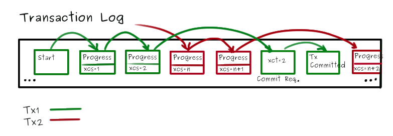

The events in the picture have following structure where
*  <b>`xid`</b> - is the transaction identifier, 
*  <b id="xcs">`xcs`</b> - is a sequential number monotonically increasing for each individual _Domain Event_ associated with a given transaction. Xcs is used to describe the precedence order of _Domain Events_ in the context of a single transaction. It is also used to distinguish between regular transaction progress events and transaction compensation events. For transaction compensation events `xcs < 0`.
*  <b>`xct`</b> - represents total count of _Domain Events_ associated with a given transaction. Its value is passed with the commit command and is used to decide when a given transaction can be actually committed.


```javascript
TransactionStartedEvent {
    Long xid
}
```
```javascript
TransactionProgressLoggedEvent {
    Long xid
    Long xcs
    DomainEvent domainEvent
}
```
```javascript
TransactionCommitRequestedEvent {
    Long xid
    Long xct
}
```
```javascript
TransactionCommittedEvent {
    Long xid
}
```
```javascript
TransactionAbortRequestedEvent {
    Long xid
}
```
```javascript
TransactionAbortedEvent {
    Long xid
}
```
```javascript
DomainEventCompensatedEvent {
    Long xid
    Long xcs
    DomainEvent domainEvent
}
```
### Transaction Commit and Abort

The flow of events through the _Transaction Aggregate_ is dictating the decision to __commit or abort a given Business Transaction__:

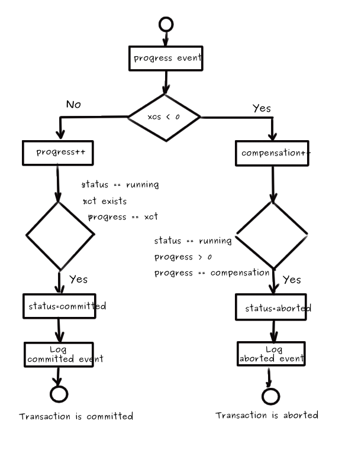

### Transaction Rollback with Semantic Compression 

SART Framework ensures data consistency generated by business validation errors or other failures by undoing all data modifications performed by the set of _Domain Events_ associated with the failing transaction. Generally speaking this is accomplished by means of __Compensation Operations__, applied iteratively on the _Domain Events_ processed so far.

SART Framework is designed to emit _Compensation Commands_ for _Domain Events_ logged by the _Business Transaction_ and include them into the aborting transaction when failures are detected. Receiving a `TransactionAbortedEvent` is a guarantee that the underlying _Business Transaction_ completed without any data side-effects.

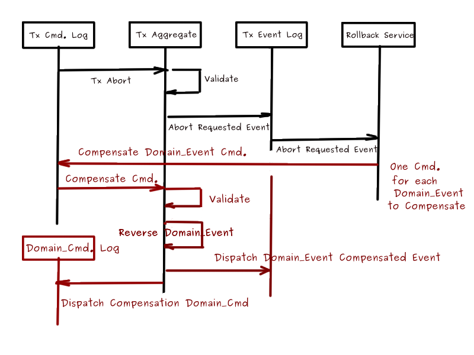

The event compensation is handled by the _Transaction Aggregate_ by invoking the `undo` operation and reversing the command sequence number `xcs`.

```java
void compensate(DomainEvent<? extends DomainCommand> domainEvent) {

   long xcs = domainEvent.getXcs();

   if (xcs > 0) {

      DomainCommand reverseCommand = domainEvent.undo(xid, -xcs);

      dispatch(reverseCommand);
   }
} 
```

The negative `xcs` values will be used to track the overall compensation progress.

It is important to acknowledge that the _undo / compensation logic is integral part of the domain design_, therefore needs carefully implemented for ALL domain specific events. Next chapter, __Domain Log__, will expand at large on how SART Framework is structuring domain specific knowledge, below we highlight only compensation related aspects embodied in the design of the _Domain Events_.

```java
public interface DomainEvent<C extends DomainCommand> extends Reversible<C> {}

public interface Reversible<C extends DomainCommand> {

    C undo(long xid, long xcs);
}
```
A simple example:
```java
public class InputDeckCreatedEvent extends GenericAggregateCreatedEvent<InputDeckDeleteCommand> {

    //...

    @Override
    public InputDeckDeleteCommand undo(long xid, long xcs) {

        return new InputDeckDeleteCommand(getAggregateKey(), getSourceAggregateVersion())
                   .addTransactionHeader(xid, xcs);
    }
}
```
Now, from the possible compensation strategies, __SART's choice is for sematic compensation__. Short overview:

#### Brute Force Compensation 
The strategy undoes one by one each atomic operation processed during transaction progress. To avoid data integrity side-effects, once the failure happens, the rollback activity has to start at the most recent position in the _Transaction Log_  and advance through the sequence of operations in reversed order.

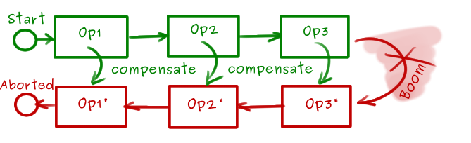

#### Semantic Compensation
The strategy leverages the domain knowledge and more specifically the operation semantics to apply compensations selectively. _This approach reduces substantially the rollback overhead._ For instance the late failure of a transaction including a  _creation_ and subsequent _modifications_ of same _Domain Aggregate_ artifact will semantically require ONLY to _undo the creation activity_, i.e. place a tombstone on the particular _Domain Aggregate_. The semantic compressed rollback activity needs to start at the earliest location in the _Transaction Log_ and advance through the sequence of operations in the natural order. Only earliest changes to any of the _Domain Aggregate_ aspects are relevant for undo operations, the rest can be discarded.

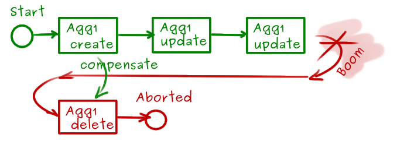

## Domain Log

The management of __Domain Commands__ and __Domain Events__ are the next important application on the _Log Structure_ in the SART Framework. __Domain Commands__ <sup>[4](#t4)</sup> are requests for operations in the business domain, __Domain Events__ <sup>[5](#t5)</sup> are records of successful state transitions in the business domain. The SART system derives its state by applying the stream of __Domain Events__ to the __Domain Aggregates__ <sup>[3](#t3)</sup> and the __Domain Views__  <sup>[6](#t6)</sup>

SART Framework supplies a predefined set of atomic operations, commands and events. They establish the foundations for the non-blocking, high throughput algorithms for conflict resolution. For instance object creations, as long as not constrained by uniqueness criteria, are inherently conflict free. 

SART Framework also builds upon _Convergent and Commutative Replicated Data Types_ research ([see Chapter CRDTs](#crdts)) to establish a set of atomic events which remain fundamentally conflict free when applied on same _Domain Aggregate_ field from multiple transactions.

Basic _Domain Commands_ have limited semantic variation as technically sufficient. They more or less follow the CRUD terminology with additions to support _Business Transaction_ testing, such forcing controlled or random failures and analyze behavior. Similar to _Transaction Commands_, _Domain Commands_ are communicated to the system by appending to the specialized _Command Log_. Current set of abstract commands included in the SART Framework is:

### Domain Aggregate Logical Structure 

```javascript
{ 
    String aggregateKey

    Long aggregateVersion

    Long xmin

    Long xmax = XMAX_NOT_SET

    Map eventsByVersion
}
```
encloses following aspects:

`aggregateKey` - the unique key of the _Domain Aggregate_. This is used as aggregate identifier and also for data partitioning such storing together aggregates which satisfy certain criteria encoded in the key, for instance boundaries established by computing the key hash  

`aggregateVersion` - the version of the aggregate. Multi-versioning suport. Each transaction will create a new version of the aggregate. The version is used also to disambiguate conflict resolution. 

`xmin` - marker for the last transaction modifying the aggregate. Relevant in computing the visibility of given _Domain Aggregate_ (or any of its projections) in the _Business Transaction_ context.

`xmax` - marker for the transaction deleting the aggregate. Not set otherwise. This is also called the tombstone. Relevant in computing the visibility of given _Domain Aggregate_ (or any of its projections) in the _Business Transaction_ context.

`eventsByVersion` - _Event Sourcing_ <sup>[10](#t10)</sup> support, a sorted map of domain events by aggregate version


### Domain Event Logical Structure


```javascript
{ 
    String aggregateKey
    
    String changeKey

    Long sourceAggregateVersion
    
    Long xid

    Long xcs
}
```

`aggregateKey` - the unique key of the _Domain Aggregate_ this event applies to

`changeKey` - the unique key associated with the particular change. The changeKey is used to identify whether 2 distinct _Domain Aggregate_ changes are disjunct or overlap. An possible example could be `aggregateKey + updatedFieldName`

`sourceAggregateVersion` - the version number of the aggregate used as source for the modification command responsible to emit current modification event. This is used for conflict resolution algorithm.

`xid` - the identifier of the transaction wrapping the current event

`xcs` - see it explained in __Transaction Log__ chapter, _Transaction Progress Logged_ [section](#xcs)


### Domain Commands

| Command name | Description  |
|--------------|--------------|
|Create Aggregate|Domain commands intended to instantiate new domain artifacts, e.g. _InputDeckCreateCommand_ should be derived from _CreateAggregateCommand_|
|Destruct Aggregate|Domain commands intended to delete existing domain artifacts, e.g. InputDeckDeleteCommand should be derived from _DestructAggregateCommand_|
|Modify Aggregate|Domain commands intended to modify existing domain artifacts, e.g. _InputDeckUpdateFileCommand_ or _InputDeckAddResultCommand_ should be derived from _ModifyAggregateCommand_|
|Test Aggregate|Categorizes a larger set of test activities not fully researched at this time. The goal is to provide built-in patterns and means to simulate possible niche behaviors such failures and to analyze the net outcome|
|Force Validation Failure|Generates a controlled validation failure, that is the _Domain Aggregate_ processing the command will fail the wrapping _Business Transaction_ and thus providing test activities the opportunity to analyze the transaction rollback / compensation functionality|


### Domain Events

Current categories of _Domain Events_ emitted by the system as result of processing the _Domain Commands_ are described in the table below. They are the atomic constituents of any transaction in form of specializations defined in the individual domains. 

When designing Domain Commands and Events using the SART Framework, following rules need followed:

1. The infrastructure can understand and act on domain specific command and events _only when derived from base counterparts delivered with the framework_

2. For reduced complexity in current transaction compensation logic the framework relies on exact one-to-one command-to-event correspondence. Individual _Domain Command_ processing should not emit more than one event. This limitation may be removed in the future if proven necessary.

| Event name | Description  | Compensated by | Conflict resolution|  
|--------------|--------------|--------------|--------------|
|Aggregate Created|Is emitted only after all related validations are performed and the new _Domain Aggregate_ is created| Compensated by __Aggregate Destructed__| Creations are conflict free|
|Aggregate Destructed|Is emitted after the destruction of a given _Domain Aggregate_. It is very important that the destruction is implemented at the logical level i.e. the record is flagged with a tombstone. This approach also ensures that aggregate destructions remain easy to compensate|Compensated by __Aggregate Destruction Reversed__|No conflict semantically possible as parallel destructions are non-conflictual and reversing destruction makes only sense after successful destruction visible hence semantically sequential. However general field update (i.e. tombstone field) conflict resolution follows the rules from __Aggregate Field Updated__|
|Aggregate Destruction Reversed|Is emitted after the destruction of a given _Domain Aggregate_ is reversed| Compensated by __Aggregate Destructed__|Same conflict resolution considerations mentioned above for __Aggregate Destructed__|
|Aggregate Field Incremented|Is emitted after incrementing a numerical field of a given _Domain Aggregate_|Compensated by __Aggregate Field Decremented__|Numerical field increment and decrement operations are conflict free (see [Chapter CRTDs](#crdts))|
|Aggregate Field Decremented|Is emitted after decrementing a numerical field of a given _Domain Aggregate_| Compensated by __Aggregate Field Incremented__|Numerical field increment and decrement operations are conflict free (see [Chapter CRTDs](#crdts))|
|Aggregate Field Element Added|Is emitted after appending a new element to a _Domain Aggregate_ collection field|Compensated by __Aggregate Field Element Removed__|This is a conflict free operation (see [Chapter CRTDs](#crdts))|
|Aggregate Field Element Removed|Is emitted after successfully removing an element from a _Domain Aggregate_ collection field. It is very important that the element removal is implemented at the logical level, i.e. the element is flagged with a tombstone.|Compensated by __Aggregate Field Element Remove Reversed__|No conflict semantically possible as parallel removals are non-conflictual and reversing removal makes only sense after successful removal visible hence semantically sequential. However general field update (i.e. tombstone field) conflict resolution follows the rules from __Aggregate Field Updated__|
|Aggregate Field Element Remove Reversed|Is emitted after removal of an element from a _Domain Aggregate_ collection field is successfully reversed|Compensated by __Aggregate Field Element Removed__|Same conflict resolution considerations mentioned above for __Aggregate Field Element Removed__|
|Aggregate Field Updated|Is emitted after successful update of a _Domain Aggregate_ field|Compensated also by __Aggregate Field Updated__|To facilitate compensation, the concrete domain specific event has to store the original value of the field. General field update conflict resolution is lock free and possible with any of the configurable algorithms (LWW, MVR, ERR) (see also [Chapter CRTDs](#crdts))|

### Non-blocking Conflict Resolution

The _Domain Event_ table describes the conflict resolution requirements (see __Conflict Resolution__ column) for all atomic event categories supplied by the SART Framework. Many from the listed operations are conflict free, hence no special action required. 

The non-blocking conflict resolution algorithm employed by the _Domain Aggregate_ to mitigate conflicting updates, i.e. __Aggregate Field Updated Event__ processed in parallel is described below: 

```java
/** 
 * Resolves aggregate field update conflicts
 */
boolean resolveUpdateConflicts(DomainEvent domainEvent, ConflictResolver conflictResolver) {

   long originalVersion = domainEvent.getSourceAggregateVersion();

   String changeKey = domainEvent.getChangeKey();

   long currentVersion = getAggregateVersion();

   boolean applyChanges = true;

   if (originalVersion < currentVersion) {

      ChangeSet changes = getChanges(originalVersion, currentVersion);

      if (changes.containsChanges(changeKey)) {

          List<DomainEvent<? extends DomainCommand>> conflictingChanges = changes.getChanges(changeKey);

          for (DomainEvent<? extends DomainCommand> conflictingChange : conflictingChanges) {

             Conflict conflict = new GenericConflict(domainEvent, conflictingChange);

             boolean resolved = conflictResolver.resolve(conflict, this);

             dispatchConflictResolvedEvent(domainEvent, changeKey, conflictingChange, resolved);

             applyChanges &= resolved;
           }
       }
   }
   
   return applyChanges;
}

/** 
 * General conflict resolution interface
 */
interface ConflictResolver {

    boolean resolve(Conflict conflict, DomainAggregate aggregate);
}

/** 
 * LWW implementation
 */
class ConflictResolver_LastWriterWins implements ConflictResolver {

    @Override
    public boolean resolve(Conflict conflict, DomainAggregate aggregate) {
        
        return conflict.getCurrentChange().getXid() > conflict.getOtherChange().getXid();
    }
}

```

## Query Logs

The speed, resilience and auditability of the _Log Structure_ makes it also the ideal persistence and communication medium for data inquiries. Such requests are modeled by the SART Framework as __Domain Queries__. The SART Framework embraces an architecture augmenting the CQRS <sup>[11](#t11)</sup> philosophy in that __Domain Queries__ are handled exclusively by denormalized _Domain Projections_ <sup>[6](#t6)</sup> tailored to individual query cases. A typical SART application will make use of multiple _Domain Projections_. It is the responsibility of the _Domain Event_ processing infrastructure to maintain all the projections in synch with the underlying _Domain Aggregates_.


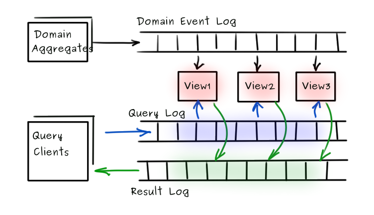

>Nota Bene: For brevity the picture above leaves out the _Query Event Log_ responsible to communicate the `QueryUnsubscribedEvents` emitted when the query subscriptions are cancelled by the clients.  

### Domain Views

_Domain Views_ <sup>[6](#t6)</sup> (named also _Domain Projections_) are first class members of the _Domain Model_ tailored to serve the application specific query cases. _Domain Views_  build their internal state from the _Domain Log_ and can be recycled at any point in time. _Domain Views_  are system continuous evolution friendly, technically NO down-time is required for the version upgrade of the projection component or to enhance the system with additional data projections (aka. functionality). 

A simplified instantiation of a _SART_ _Domain Projection_  using annotations to wire together the _Domain Event_ and _Domain Query_ channels is exemplified below:

```java
@Service
public class InputDeckProjection extends AnnotatedDomainProjection {

    private final InputDeckRepository inputDeckRepository;
    
    @DomainEventHandler
    @Transactional
    public void on(InputDeckCreatedEvent inputDeckCreatedEvent) {...}

    @DomainEventHandler
    @Transactional
    public void on(InputDeckResultAddedEvent resultAddedEvent) {...}
    
    @DomainQueryHandler
    public List<? super QueryResult> findByInputDeckName(InputDeckByNameQuery query) {...}
    
  ...
}
```
where `InputDeckRepository` is used to store the projected data and can for instance implement Spring's `JpaRepository` interface:

```java
public interface InputDeckRepository extends JpaRepository<InputDeckEntity, EntityIdentity> {
   
    List<InputDeckEntity> findByInputDeckName(String inputDeckName);
    
    ...
}
```

### Domain Query Logical Structure
```javascript
abstract class DomainQuery { 

    String queryKey
    
    Long xid
    
    Integer isolation

    SystemSnapshot systemSnapshot;
    
    Boolean subscription
}

abstract class SystemSnapshot { 
    
    Long highestCommitted
    
    Set<Long> runningTransactions
}
```
`queryKey` - the unique key of the _Domain Query_. This is used to correlate the results to a specific query.

`xid` - the transaction identifier associated with current query. It is required to compute result visibility when preserving the appropriate transaction isolation.

`isolation` - the isolation level associated with the current query. This is typically the same for all queries associated with a given transaction but can be also query specific. 

`systemSnapshot` - the snapshot of the transactions progressing in the system. To compute query result visibility when _SNAPSHOT_ISOLATION_ level is specified, the snapshot is retrieved at the time current transaction has been started. To compute query result visibility when _READ_COMMITTED_ level is specified, the snapshot is retrieved at the query processing time. 

`subscription` - distinguishes between interactive and reactive queries. When `true` the _Domain View_ is responsible to publish new results matching the query until `QueryUnsubscribedEvent` cancels the subscription. 

### Data Versioning

We mentioned in previous section that _SART_ provides strict version tracking for _Domain Aggregates_ relevant for instance in case of conflict resolution. This is known as _Multi Version Concurrency Control_ <sup>[12](#t12)</sup> and represents one important technique for the implementation of the transaction isolation in general. As _Domain Queries_ are handled exclusively by projections of _Domain Aggregates_, __it becomes imperative that _Domain Views_ are _MVCC_ capable__.

_SART_ projection records remain immutable, data changes associated with a given transaction are combined in a new _Projected Entity_ record tracking the transaction responsible for the change with `xmin` and in case of deletion with the tombstone `xmax`, also tracking the transaction responsible for object destruction.

```javascript
abstract class ProjectedEntity { 

   String aggregateKey
   
   long aggregateVersion
   
   long xmin
   
   long xmax = XMAX_NOT_SET
}
```

`aggregateKey` - the aggregate unique identifier, together with `aggregateVersion` represents the primary key of the `ProjectedEntity` record

`aggregateVersion` - the version of the aggregate, together with `aggregateKey` represents the primary key of the `ProjectedEntity` record

`xmin` - stores the transaction identifier `xid` responsible for the present modification of the logical object

`xmax` - stores the transaction identifier `xid` responsible for the deletion of the logical object


Assuming a traditional relational table based projection, each version of the projected entity will be represented as a distinct row.

| Aggregate Key | Aggregate Version  | Xmin | Xmax      | Attr1 | Attr2 ...|
|---------------|--------------------|------|-----------|-------|----------|
| K1            |v1                   |12    |NOT_SET   |aaaa   |bbb       |
| K1            |v2                   |19    |NOT_SET   |aaaa   |ccc       |
| K1            |v3                   |75    |14        |aaaa   |ccc       |

In a system where transaction identifiers are numbers increasing monotonically the task to support configurable isolation levels becomes solvable at _read time_.

### Transaction Isolation

__Isolation.READ_UNCOMMITTED__ - Queries issued by a given transaction can see all versions of the data. This represents an important instrument for system monitoring and observability. 

__Isolation.READ_COMMITTED__ - Queries issued by a given transaction _are seeing committed data only_. The main problem of _READ_COMMITTED_ isolation level are the inconsistent reads very probable to happen with high concurrency and long running transactions. That is, when same query is performed multiple times, different results, originating in the modifications performed by parallel transactions committed in the background, may be returned.


__Isolation.READ_SNAPSHOT__ - Queries issued by a given transaction _are seeing a consistent and immutable snapshot of the data captured when the transaction has been started_. This approach is addressing the fundamental concern with _READ_COMMITTED_ isolation level, therefore also named _REPEATABLE_READ_ isolation.

The logical filter applied to any _MVCC_ projection to meet the `Isolation.READ_SNAPSHOT` or `Isolation.READ_COMMITTED` requirements can be expressed as follows:

```javascript
(xmin <= highestCommitted AND xmin NOT INCLUDED [running transactions] AND (xmax == NOT_SET || xmax > xid))
```
The only distinction is the time used to capture the snapshot information `highestCommitted`, `[running transactions]` which is either the _transaction start_ for `Isolation.READ_SNAPSHOT` or the _query start_ for `Isolation.READ_COMMITTED`.


## Component API

To recapitulate, the _SART Framework_ has a strong bias towards explicit and semantically stable data. Consequently _Domain Commands and Domain Events_ that drive the application state transitions are also exposed as first class citizens of the interaction APIs. The proposed design goes further, _Domain Queries and Domain Results_ are instantiated in equivalent _log structures_ with precise semantics and identity, hence stability over time. Mandatory _versioning_ of the mutable structures is used for tracking stable application states and disambiguate conflict resolution therefore __the identity and the version__ of the _Domain Aggregate_ represent an essential aspect of the _Domain Command and Domain Event_ structure and correspondingly of the client APIs.

There is also a substantial evolution compared to traditional Simulation Data Management APIs towards asynchrony by eliminating, minimizing or explicitly controlling sequential execution needs at client interaction. Whether internal or at the integration points the design choice has been made consistently towards non-blocking interaction. 

The architecture of the SART Framework is modular and distributed, however the exposed APIs are unifying and ensure location transparency.


```java
        /*
         * Create and configure the interaction unit
         */
        driver.createDomainTransaction(Isolation.READ_SNAPSHOT)

        /*
         * Listen and act on transaction failure / abort events
         */
        .onAbort(abortEvent -> {

            LOGGER.info("Transaction aborted");
        })

        /*
         * Listen and act on transaction successful completion
         */
        .onCommit(commitEvent -> {

            LOGGER.info("Transaction committed");
        })

        /*
         * Listen and act on incremental progress events
         */
        .onProgress(inputDeckCreated -> {

            LOGGER.info("InputDeckCreatedEvent event detected {}", inputDeckCreated.getInputDeckName());

        }, InputDeckCreatedEvent.class)


        /*
         * Start the transaction explicitly
         */
        .start()

        /*
         * Append the actual data creation and modification commands. Condensed syntax like 
         * {@link #executeCommand(...)} provides a template to include full transaction lifecycle 
         * i.e {@link #start()} and {@link #commit()} functionality
         */
        .appendCommand(() -> new InputDeckCreateCommand(id, inputDeckName, inputDeckFile))
        
        /*
         * Commit the transaction explicitly
         */
        .commit()
        
        /*
         * Chain serially a new transaction, specifies (optionally) the isolation level
         */
        .serialTransaction(Isolation.READ_SNAPSHOT)
        
        /*
         * Send query messages and subscribe for results
         */
        .executeQuery(true, new InputDeckByNameQuery(inputDeckName), InputDeckQueryResult.class, result -> {
        
           LOGGER.info("Got result {}", result.getInputDeckName());
        });

```

The above snippet is entirely non-blocking, excepting the intentional chaining of a secondary transaction `.serialTransaction()` used here to demonstrate and test the isolation capabilities. Deserves also noted the first argument of `.executeQuery()` call which distinguishes between returning matching query results existing in the database at the time of the query or additionally watching the database content for future matches. 


## Observability

Indisputably the traditional Simulation Data Management deployments benefit extensively from the execution insights exposed by technologies such as the __monitoring infrastructure__. This proven to be instrumental on exposing the quality, behavior and performance of data processing activities in general and database interactions in particular. Unfortunately, in the same time, the deployments suffer because of the limited monitoring scope and the negative impact on scalability and performance of the subjected system, especially in the productive environments.

There is also important to distinguish the _reactive, after the fact_ nature of the classic _Simulation Data Management profiling_. Typically monitoring is instrumented on a secondary / test system mirroring as much as possible the productive environment with the declared hope to reproduce the faulty use-cases. This definitely proven not always to be possible. While still a powerful instrument, this approach lacks the proactiveness of continuously monitoring critical aspects of a given application feature and act promptly, ideally fully automated, on behavior changes.

The _SART Framework_ choice on externalizing state in _log structures_ and the exclusive message driven approach to state transitions as well as data access presents itself as a huge opportunity to re-think ground-up system monitoring. Such capacity of a software system to expose knowledge of its internal states and behavior was identified and coined in the industry as _Observability_. 

It is important to note that _SART Observability_ is by no means an artificial add-on but __emerges naturally as just another level of detail exposed by the common APIs__.

Following snippet demonstrates for instance how to acquire the timeline associated with the milestones relevant for the internal processing associated with specific functionality and implicitly __monitor the performance__ of the given use-case.


```java
CompletableFuture<InputDeckQueryResult> queryLock = new CompletableFuture<>();

InputDeckMonitor monitor = new InputDeckMonitor();

driver.createDomainTransaction()

   .onStartQuery(true, new InputDeckByNameQuery(inputDeckName), InputDeckQueryResult.class, result -> {

       monitor.setEntityCreationTime(result.getEntityCreationTime());
                
       monitor.setResultCreationTime(result.getResultCreationTime());
                
       monitor.setQueryReturnTime(System.currentTimeMillis());

       queryLock.complete(result);
    })

    .onProgress(inputDeckCreated -> {
                
       monitor.setEventCreationTime(inputDeckCreated.getCreationTime());
                
    }, InputDeckCreatedEvent.class)

    .start()

    .appendCommand(() -> {

        InputDeckCreateCommand command = new InputDeckCreateCommand(id, inputDeckName, inputDeckFile);

        monitor.setCommandCreationTime(command.getCreationTime());

        return command;
    })

    .abort();

InputDeckQueryResult r = queryLock.get(10, TimeUnit.SECONDS);


long eventDispatchLatency = monitor.getEventCreationTime() - monitor.getCommandCreationTime();

long projectionSynchronizationLatency = monitor.getEntityCreationTime() - monitor.getEventCreationTime();
        
long resultCreationLatency =  monitor.getResultCreationTime() - monitor.getEntityCreationTime();
        
long resultTransferLatency =  monitor.getQueryReturnTime() - monitor.getResultCreationTime();

```
Aborting the transaction at the end of the exercise ensures no data side-effects. 

Regular clients or specialized agents can rely on similar techniques to collect execution and performance information, correlate it with underlying scenarios and adjust their behavior using larger feedback loops. For instance intelligent algorithms can compile in real-time the execution parameters into instructions for individual component configuration like favoring latency over throughput, slow-down or speed-up command production, etc. 

The proposed design provides also natural means to __monitor the functionality__ in its most intimate details, for instance conflict resolution decisions that are streamed interactively as conflict resolution events can be assessed and acted upon in real-time. Following code fragment demonstrates a simple logic to force the complete transaction rollback when unfavorable conflict resolution choices are detected:

```java
     /*
      * Observe conflict resolution and alter behavior: Abort transaction
      * when unfavorable conflict resolution choices are detected
      */
    .onConflict(conflictResolved -> {
       if(currentTransaction.getXid() != conflictResolved.getWinnerXid()) {
          if(isFileChange(conflictResolved.getChangeKey())){
             currentTransaction.abort();
          }
       }
    })
```

or queried on-demand from the built-in conflict resolution projections, eg.

```java
   
   .onQuery(true, new ConflictsByAggregateQuery(aggregateKey), ConflictResolvedResult.class,
   
       conflictResolvedEvent -> LOGGER.info("Conflict found {}", conflictResolvedEvent)
    );
```
SART transactions provide also a built-in extensible audit mechanism. This is extremely useful when observing and/or debugging the deployed applications. Like with all other SART commands, once specific transaction details are attached, an event of type `TransactionDetailsAttachedEvent` is published to the transaction log. Details can be either attached explicitly by using the transaction API:

```java
driver.createDomainTransaction()
        
    .onDetailsAttached(detailsAttachedEvent -> {
        ...
     })

    .attachTransactionDetails(TraceDetail.START_TRACE, new TraceDetailFactory())

    .executeCommand(() -> {     
        ...
     });
```
or enabled globally at the driver level by invoking the `registerDetailFactory(DetailFactory<T>  detailFactory)` method on `RestTransactionDriver`. All configured categories of details will be attached to the transactions created by respective driver instance:

```java
TransactionDriver driver = new DefaultRestTransactionDriver()
    .registerTransactionApi(new RestTransactionApi())
    .registerQueryApi(new RestConflictQueryApi())
    .registerCommandApi(new RestSimulationApi())
    .registerDetailFactory(new TraceDetailFactory())
    .init();
    
driver.createDomainTransaction()
...
```
At the time when writing current lines only one attachment factory and detail category is supplied with SART, that is `TraceDetailFactory` respectively `TraceDetail` which provide runtime execution information associated with the origin of the respective transaction.

```java
class TraceDetail extends AbstractDetail {

    String hostName;
    
    String hostAddress;
    
    String className;
    
    String methodName;
    
    int lineNumber;
    
    StackTraceElement[] stackTrace;
}
```
An interesting display of the enhanced SART monitoring capabilities is prototyped as a simple javascript routine subscribing to the real-time event stream published by the reactive REST-ful transaction API. The graphics are generated with the [plotly.js](https://plot.ly/javascript/) library. The content is accessible as a [simple HTML page](http://localhost:8080/sart.html) available as resource to the transaction kernel.

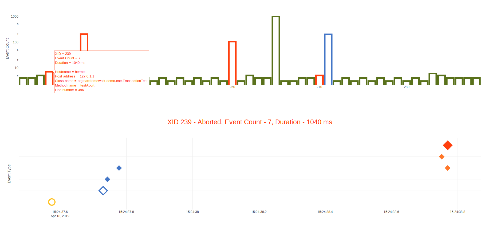  


## Functional Evolution

Any application following SART principles described so far exposes scalability characteristics more or less congruent with wide scale deployments. However there are emergent properties of large and complex systems which need pro-actively accounted for. 

For instance a large system cannot be managed anymore as a single unit, the software needs partitioned into components having right granularity when correlated with the business case. Even further such large systems do not afford anymore a general orchestrated down-time and probably not even partial functional down-times, the system as a whole and any specific functionality has simply to remain available 24/7. 

Even more, such systems need to evolve and because of the size, functional updates are becoming part of daily operations. The million dollar question becomes not only how to upgrade software components in such environment but how to ensure that individual upgrades do not disrupt in any way ongoing operations. For instance in simulation data management is critical that long running simulation jobs (ie. started 1 week before) are continued and complete successfully even if an upgrade process happened during their execution.

The adopted and evolved CQRS style is an enabler in that multiple _Domain Views_ (or _Domain View_ versions) can simply coexist. That is, when new query cases are introduced new _Domain Views_ can be naturally spawned and be initialized from the _Domain Log_ (more specifically from the _Domain Event Log_) which, as we have learned, preserves all historical state transitions. As far as a version based correlation between software modules and _Domain Views_ (aka. projections) the new versions can coexist with the historical ones. Retiring old (version) functionality becomes more or less a business decision and is simply a life cycle operation of redirecting requests from _Domain Views_ to be retired to the latest versions. Interesting to observe that this is not even a binary choice, multiple versions of the same service can be maintained at any moment in time.

Equivalent principles need to cover however not only the projections but also the source of truth for SART system, which are the structures / operations stored with the _Domain Logs_. The request is that the framework postulates the rules required for the organic, iterative and incremental evolution of the logged data structures (ie. _Domain Commands_, _Domain Events_, _Domain Queries_, _Domain Results_ and _Domain Aggregates_).

### Functional growth and compatibility rules

We postulate that continuous system evolution is possible if:

__A. New components__ can process __old versions of the logged data structures__

__B. Old components__ can process __new versions of the logged data structures__

__C. The version employed for the deserialization__ of the logged structures __is a runtime choice__

__D. The deserialization platform__ can __fill missing values__ when mandatory new attribution is inexistent in older versions 

A system with all above prerequisites met can guarantee the compatibility between the software component and their underlying logged structures, eg. between evolving _Domain Commands_ or _Domain Events_ and corresponding _Domain Views_ or clients.

Therefore __versioning__ and __serialization__ aspects of all domain specific artifacts (ie. _Domain Commands_, _Domain Events_, _Domain Queries_, _Domain Results_ and _Domain Aggregates_) are first class descriptors and actually mandatory when implementing any SART based system. __Versioning, identity and serialization mechanism__ is specified via the `@Evolvable` annotation. For instance:


```java
@Evolvable(identity="cae.event.InputDeckCreated", version = 1)
class InputDeckCreatedEvent extends GenericAggregateCreatedEvent<InputDeckDeleteCommand> {
    //...
}
```
where

* __Unspecified identity__ defaults to the __unqualified name of the java class__, hence subsequent class versions would have to preserve the class name and provide an alternate namespace / package, evtl. encoding the version number
* __Unspecified serializer__ defaults to __platform default content serializer/deserializer__

```java
@Documented
@Retention(RUNTIME)
@Target(TYPE)
public @interface Evolvable {

    int version();
    
    String identity() default "";
    
    Class<? extends ContentSerializer> serializer() default UnspecifiedContentSerializer.class;
}
```
### Functional growth and compatibility design guidelines

SART satisfies the general __continuous functional growth and compatibility requirements__ by superimposing following design restrictions:

__A. The data structures should contain only non-private fields__. This simplification is only useful so that the compiler can validate potential name clashes in derived classes which is relevant for serializers / deserializers identifying fields by name rather than index.

__B. Old data structure versions need preserved unchanged.__ That is once created and in use a java class will have to stay. Its structure will have to remain unchanged. Retiring should remain possible. See the corollary at F.

__C. Newly evolved data structures should be derived from the most recent versions.__ This is needed so that a deserialized java classes can be freely downcasted or upcasted by the platform to older or newer versions at the choice of consuming components.

__D. Newly evolved data structures can include additional fields.__ 

__E. Mandatory fields__  of newly evolved data structures can be __initialized by registering dedicated adapters__ associated with the specific data structure

__F. As corollary__ on above rules, SART still provides the possibility to retire old data structures but the procedure has to ensure that all networked components can consume the later versions. Before retiring, the inheritance chain needs adapted so that the evicted class is no more part of it. 

Below we describe a partial example of a theoretical evolution from an `OriginalCommand` to an `EvolvedCommand` :

```java
@Evolvable(identity = "test.command.create", version = 1)
public class OriginalCommand extends GenericCreateAggregateCommand<OriginalCommand> {
   //...       
}

@Evolvable(identity = "test.command.create", version = 2)
public class EvolvedCommand extends OriginalCommand {

    String phase;
    //...
}

public class PhaseAdapter implements Adapter<EvolvedCommand> {

    public void adapt(EvolvedCommand input) {
       
       input.setPhase(DEFAULT_PHASE_VALUE);
       //...
    }
}

PlatformOperationRegistry.get().registerAdapter(EvolvedCommand.class, new PhaseAdapter());

```

## Terminology 

<b id="t1">Domain Driven Design</b>  - is an extensive set of design practices, techniques, and principles coined by Eric Evans in his seminal book _Domain-Driven Design: Tackling Complexity in the Heart of Software_ 

<b id="t2">Ubiquitous Language</b>  - is a pattern in Domain-Driven Design. Represents a vocabulary used by all people involved in the domain, domain model, implementation, and backends. The idea is to avoid translation, because _Translation blunts communication and makes knowledge crunching anemic_.

<b id="t3">Domain Aggregate</b> - is a pattern in Domain-Driven Design. Represents a cluster of domain specific objects that we treat as a unit for the purpose of data changes.

<b id="t4">Domain Command</b> - is a pattern in Domain-Driven Design. Represents a request to the business domain.

<b id="t5">Domain Event</b> - is a pattern in Domain-Driven Design. Represents a fact that took place in the business domain. 

<b id="t6">Domain View</b> - is a projection of the _Domain Aggregate_ tailored to specific query activities. The term is interchangeable with _Domain Projection_. In a CQRS perspective this describes the persistence structures associated with the _Query Model_. In a traditional database system  correspond to _Materialized Views_ serving a category of queries.

<b id="t7">Transaction Command</b> - is a specialization of _Domain Command_ <sup>[4](#t4)</sup> and represents a request to the _Transaction Domain_

<b id="t8">Transaction Event</b> - is a specialization of _Domain Event_ <sup>[5](#t5)</sup>  and represents a fact that took place in the _Transaction Domain_. 

<b id="t9">Transaction Aggregate</b> - is a specialization of _Domain Aggregate_ <sup>[3](#t3)</sup> tailored to the _Transaction Domain_. 

<b id="t10">Event Sourcing</b> - is a pattern in Domain-Driven Design. The state of an object is preserved as the sequence of events responsible for all historical change transitions. The explicit state of the object is obtain by replaying the events. 

<b id="t11">CQRS</b> - is a pattern in Domain-Driven Design. Stands for _Command Query Responsibility Segregation_. Promotes strong separation between data creation and query models.  

<b id="t12">MVCC</b> - is a concurrency control method. Stands for _Multi Version Concurrency Control_. Unlike database systems which use locks for concurrency control, MVCC maintains data consistency by using a multiversion model. This means that while querying a database each transaction sees a snapshot of data (a database version) as it was some time ago, regardless of the current state of the underlying data. 


## Bibliography

<b id="r1">Eric Evans</b>, Domain-Driven Design: Tackling Complexity in the Heart of Software

<b id="r2">Martin Kleppmann</b>, Design Data-Intensive Applications

<b id="r3">Marc Shapiro et al</b>, A comprehensive study of Convergent and Commutative Replicated Data Types

<b id="r4">Martin Thompson</b>, Single Writer Principle, LMAX Achitecture

<b id="r5">Wikipedia</b>, Directed Acyclic Graph (DAG)

<b id="r6">Pat Helland</b>, Data on the Outside versus Data on the Inside 

<b id="r7">Martin Kleppmann</b>, Turning the database inside-out with Apache Samza

<b id="r8">Ben Stopford</b>, Power of the Log: LSM & Append Only Data Structures

<b id="r9">Adam Jacobs</b>, The Pathologies of Big Data

<b id="r10">Pat Helland</b>, Immutability Changes Everything

<b id="r11">Association for Computing Machinery</b>, ACM Queue Newsletter

<b id="r12">The Reactive Manifesto</b>

<b id="r13">Jay Kreps</b>, The Log: What every software engineer should know about real-time data's unifying abstraction

<b id="r14">Peter Bailis et al</b>, UC Berkeley, Scalable Atomic Visibility with RAMP Transactions 

<b id="r15">Bruce Momjian</b>, MVCC Unmasked, How Multiversion Concurrency Control is implemented in Postgres

<b id="r16">Richard P. Gabriel</b>, Conscientious Software

<b id="r17">Wikipedia</b>, Observability, how well internal states of a system can be inferred from knowledge of its external outputs


